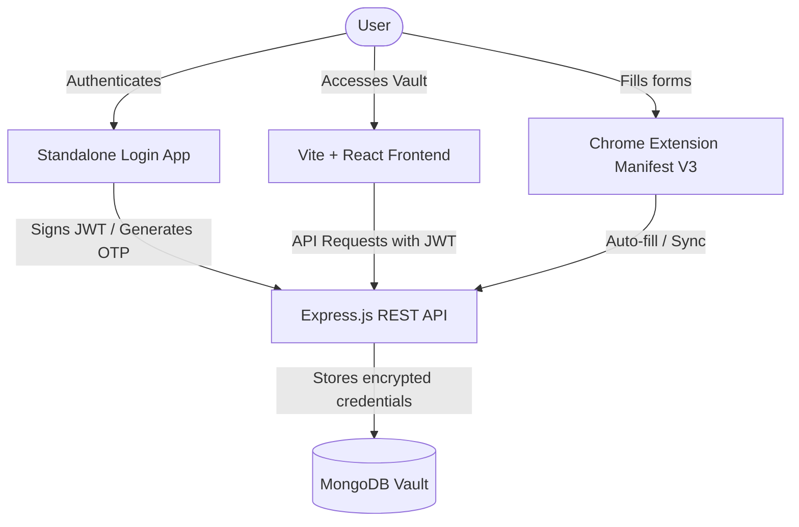
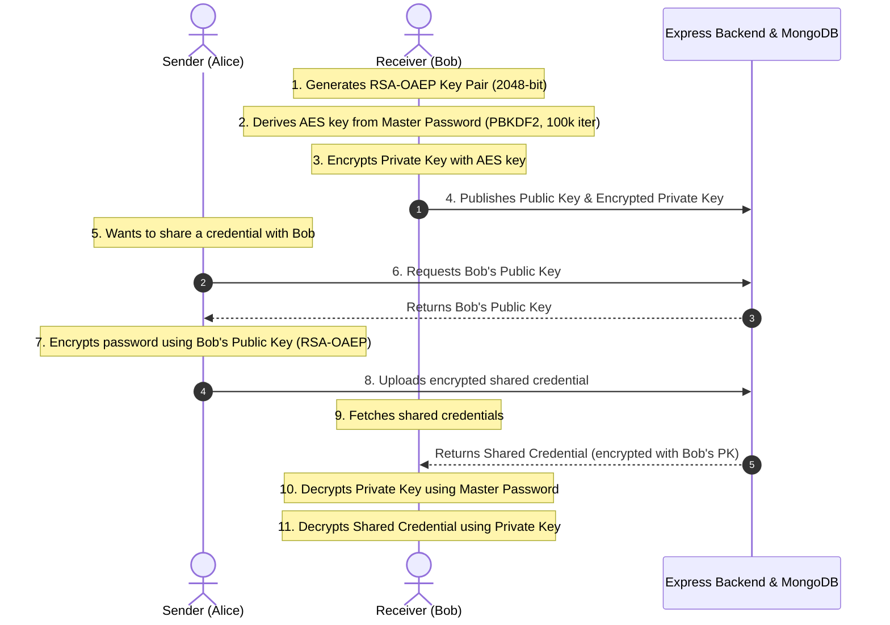

# PassGuard: The Minimalist Vault for Your Digital Life

Welcome to **PassGuard**, a modern, responsive, and cryptographically secure Password Management Suite. Built from the ground up to protect personal digital credentials, PassGuard combines the security of local zero-knowledge cryptography with the convenience of an integrated browser extension and real-time security analytics.

This document provides a detailed overview of the PassGuard project, highlighting its design principles, user features, cryptography design, codebase architecture, and deployment procedures.

---

## 🧭 System Overview

PassGuard is designed to eliminate the friction of modern digital security. Rather than relying on clunky, enterprise-oriented interfaces, PassGuard offers a tailored, glassmorphic layout focused on accessibility and technical precision.



---

## ✨ Key Features

### 📊 1. Password Security Dashboard
Powered by dynamic data visualizations, the main dashboard provides a birds-eye view of your digital safety:
*   **Security Health Score**: Calculated using password strength metrics across your entire vault.
*   **Vulnerability Detection**: Automatically scans your credentials to highlight duplicate or weak passwords.
*   **ApexCharts Analytics**: Rich, beautiful, visual charts tracking security hygiene and updates over time.

### 🛡️ 2. Real-Time Strength Checker
An entropy-based evaluation tool that analyzes password complexity on the fly:
*   **Cracking Time Estimation**: Provides clear metrics indicating how long it would take brute-force algorithms to compromise a password.
*   **Visual Complexity Bar**: Dynamic color gradients changing from crimson (unsafe) to deep indigo/purple (safe).
*   **Rule Validation**: Verifies requirements for uppercase letters, lowercase letters, numeric digits, symbols, and length.

### 🎲 3. Smart Password Generator
A secure, customizable generator that creates high-entropy, unpredictable credentials:
*   **Configurable Length**: Create passwords ranging from 8 up to 64+ characters.
*   **Option Toggles**: Choose to include or exclude uppercase, lowercase, numbers, and special symbols.
*   **Deterministic Entropy**: Generates secure combinations using cryptographically random values via standard web APIs.

### 🔒 4. Secure Vault Manager
A central panel for organizing and interacting with your stored logins:
*   **Decrypted View**: View site links, usernames, and passwords with secure toggle buttons.
*   **Instant Copy**: Single-click actions to copy credentials directly to the clipboard.
*   **Metadata Tracking**: Logs the date of creation and last update for each record.

### 🔌 5. PassGuard Browser Extension
A Google Chrome Manifest V3 browser extension that extends the vault directly to your browser bar:
*   **Credential Scraper & Auto-Fill**: Detects username and password input elements on web forms to auto-fill details on demand.
*   **Vault Synchronizer**: Syncs with the Express API using JWT authentication to query credentials matching the active tab's domain.
*   **Lightweight Scripting**: Uses non-intrusive content scripts to guarantee optimal browser performance.

### ✉️ 6. Secure Authentication & Verification
*   **OTP Verification**: Multi-factor signup and recovery utilizing temporary, one-time passwords delivered via Nodemailer/Mailtrap.
*   **JWT Sessions**: Secure session tokens stored locally to authorize API requests securely.

---

## 🔒 Cryptographic Architecture

PassGuard implements a robust hybrid cryptosystem that provides absolute confidentiality for shared credentials and end-to-end data integrity.



### 🗝️ Client-Side Security (Zero-Knowledge Sharing)
1.  **RSA-OAEP (2048-bit)**: Used for secure, asynchronous password sharing between users. Key pairs are generated via the `window.crypto.subtle` API.
2.  **PBKDF2 Key Derivation**: Derives a 256-bit AES-GCM key from the user's master password using **100,000 iterations** of HMAC-SHA-256 and a 16-byte random salt.
3.  **AES-GCM (256-bit)**: Used to encrypt the user's private key before uploading it to the database, ensuring that even if the server is compromised, the user's private key cannot be accessed without the master password.

### 🗄️ Server-Side Security
1.  **AES-256-CBC Encryption**: Credential records saved in the database have their passwords encrypted using Node.js's standard `crypto` module. A unique initialization vector (IV) is appended to each stored cipher (`iv:encryptedHex`).
2.  **bcryptjs Hashing**: User account login passwords are hashed with a secure salt work-factor before saving to prevent cleartext disclosure.

---

## 🛠️ Tech Stack & Directory Structure

PassGuard is organized as a monorepo separated into distinct, specialized modules:

| Subfolder | Technology / Libraries | Purpose |
| :--- | :--- | :--- |
| **`frontend/`** | React 19, Vite, React Router, TailwindCSS/Vanilla CSS, ApexCharts | Web App Vault UI & Analytics |
| **`backend/`** | Node.js, Express, Mongoose, MongoDB, JWT, bcryptjs, Nodemailer | Core REST API, Auth & Storage |
| **`Extension/`** | Manifest V3, Content Scripts, Vanilla JS, Chrome Storage APIs | Chrome Extension Autofill |
| **`Login/`** | React 19, Vite, TailwindCSS | Standalone Auth Portal |

### 📂 Repository Layout
```
Password-Manager-React/
├── frontend/             # Main client application (Vite + React)
│   ├── src/
│   │   ├── Components/   # Reusable UI features (Dashboard, VaultModal, Profile)
│   │   ├── context/      # React contexts (e.g., ShareContext for key syncing)
│   │   └── utils/        # Cryptography and API communication layers
│   └── package.json
│
├── backend/              # Node.js API server
│   ├── index.js          # API routing, encryption helper, Mongoose schemas
│   ├── utils/            # OTP and Mailer modules
│   └── package.json
│
├── Extension/            # Browser Extension
│   ├── manifest.json     # Extension description, background scripts, content scripts
│   ├── content.js        # Form parsing and credential auto-filling logic
│   └── popup.js          # Vault list and authentication helper popup
│
└── Login/                # Standalone Login application
    └── src/              # Login, Register, and OTP verification layouts
```

---

## 🚀 Getting Started

To run the full suite locally:

### 1. Database & Environment Configuration
Start a local MongoDB instance on `mongodb://localhost:27017` or obtain a MongoDB Atlas URI.

**Backend Setup (`backend/.env`):**
```env
PORT=5000
DATABASE_URL=mongodb://localhost:27017/passwordManager
JWT_SECRET=your_jwt_secret_key
ENCRYPTION_KEY=v6yB$E&H)MbQeThWmZq4t7w!z%C*F-Ja  # Must be 32 bytes
EMAIL_USER=your_smtp_user
EMAIL_PASS=your_smtp_password
```

**Frontend Setup (`frontend/.env`):**
```env
VITE_API_URL=http://localhost:5000/
VITE_LOGIN_URL=http://localhost:5173/login
```

### 2. Run the API and Web App
1.  **Backend**:
    ```bash
    cd backend
    npm install
    npm start
    ```
2.  **Frontend**:
    ```bash
    cd ../frontend
    npm install
    npm run dev
    ```

### 3. Install the Chrome Extension
1.  Open Google Chrome and go to `chrome://extensions/`.
2.  Toggle **Developer mode** in the upper right.
3.  Click **Load unpacked** and select the `/Extension` directory from this repository.

---

## 🌌 Brand Personality & Design Principles

*   **Trust Through Simplicity**: Clean, uncluttered layouts with clear contrast ratios that prioritize ease of access and safety.
*   **The Calm Contrast Rule**: Neon indigos and purple accents are utilized sparingly as gradients or micro-animations, while deep backgrounds breathe, creating a secure vault-like feeling.
*   **Zero-Knowledge Integrity**: User data remains strictly under the user's control. Cryptographic keys are processed and decrypted in-browser, maintaining ultimate confidentiality.
